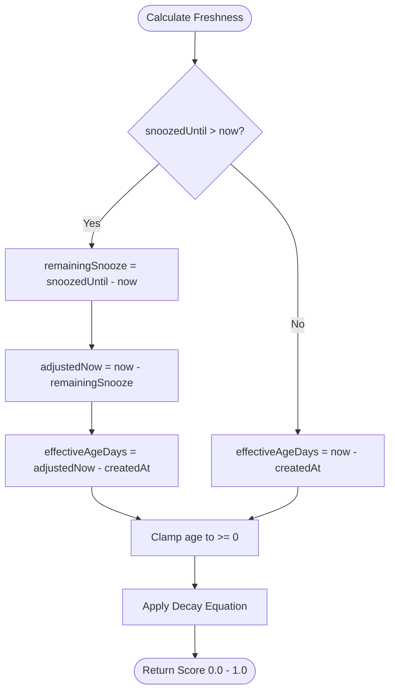

# The Freshness Decay Engine

The defining mechanic of LinkShelf is that saved links decay in real time. Rather than treating your reading list as an infinite stack, LinkShelf uses mathematical decay curves to represent the shelf life of information. 

---

## ✦ Decay Mathematics

Users can toggle between two decay profiles in settings: **Exponential Decay** (default) and **Linear Decay**.

### 1. Exponential Decay (Default)
Exponential decay models information decay based on natural half-lives. A link's score drops by exactly half for every half-life duration elapsed.

$$Freshness(t) = 0.5^{\left(\frac{t_{effective}}{t_{half-life}}\right)}$$

Where:
- $t_{effective}$: The age of the link in days, adjusted for snoozes (see below).
- $t_{half-life}$: The half-life configuration in days (global default: 7 days).

### 2. Linear Decay
Linear decay drops a link's score to zero at exactly double its half-life duration.

$$Freshness(t) = 1.0 - \left(\frac{t_{effective}}{2 \times t_{half-life}}\right)$$

The resulting score is clamped to the range $[0.0, 1.0]$.

---

## ✦ Snooze Calculation (Decay Freezing)

Snoozing a link pauses its decay. Rather than storing a static "frozen" state flag, the engine dynamically adjusts the link's **effective age** during score computation:

By subtracting the remaining snooze duration from `now`, the effective age calculation halts at the point where the snooze was applied, ensuring a smooth continuation of decay once the snooze expires.

---

## ✦ Freshness Threshold Bands

Scores map directly to visual feedback cues in the UI:

| Score | Label | Visual Accent | State Representation |
|---|---|---|---|
| `> 0.80` | **Fresh** | 🟢 Green | Newly captured; high information relevance. |
| `0.50 – 0.80` | **Fading** | 🟡 Yellow | Transitioning; start checking headers. |
| `0.25 – 0.50` | **Stale** | 🟠 Orange | Elevated priority; surfaces higher in default sort. |
| `< 0.25` | **Critical** | 🔴 Red | High urgency; risk of deletion or notification warning. |

---

## ✦ Overrides Precedence Hierarchy

A link's half-life ($t_{half-life}$) is calculated by searching for overrides in the following order of precedence:

1. **Per-Link Custom Overrides**: Set via a slider on the link detail screen.
2. **Domain-Specific Overrides**: Configured in Settings as custom half-lives for specific domains (e.g., `youtube.com` decays faster or slower).
3. **Tag-Specific Overrides**: Configured in Settings for specific tags (e.g., `#news` decays in 2 days, while `#reference` has a 30-day half-life).
4. **Global Base Half-life**: The default system fallback setting (7 days).
