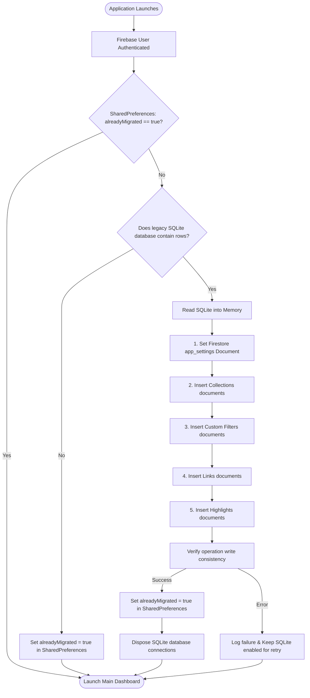

# Legacy SQLite to Firestore Migration System

To transition from a local-only architecture to a cloud-synced system, LinkShelf integrates a automatic database migration utility. The system detects legacy SQLite structures, ports all user records to Cloud Firestore, and decommissions the local database resources.

This document outlines the migration sequence, safety policies, and schema translation logic.

---

## ✦ The Migration Lifecycle

The migration is executed on first startup immediately after silent authentication completes:

---

## ✦ Step-by-Step Data Porting Flow

The migration routine reads SQLite records using **Drift** and writes them to Cloud Firestore.

### 1. Verification of Pre-flight States
The `MigrationService` checks for migration completion status:
- If SharedPreferences key `sqlite_migrated_to_firestore` is set to `true`, the system bypasses SQLite checks entirely, avoiding initialization overhead.
- If it is `false` or missing, the system initializes the Drift database and executes pre-flight checks.

### 2. Migration Order and Data Mapping
To preserve relational integrity (such as link collection bindings), documents are inserted sequentially:
1. **App Settings**: Global preferences, themes, and decay configurations.
2. **Collections**: Folder structures and layout tags.
3. **Custom Filters**: Rule templates for Smart Lists.
4. **Links**: Individual article records, notes, and cover metadata (retaining original document IDs).
5. **Highlights**: Quotations and snippets linked to saved URLs.

### 3. Fail-Safe Operations
To prevent data loss and duplicate migrations:
- **No Purge Policy**: Local SQLite data is never deleted automatically on the client. It is simply disabled by setting the SharedPreferences flag to `true`. This guarantees that if a migration is aborted mid-process, the user's data remains intact locally and can be recovered.
- **Error Catcher**: Any exception caught during the migration process logs the failure, leaves the `sqlite_migrated_to_firestore` flag as `false`, and permits the application to continue in read-only local mode or retry on next reboot.
