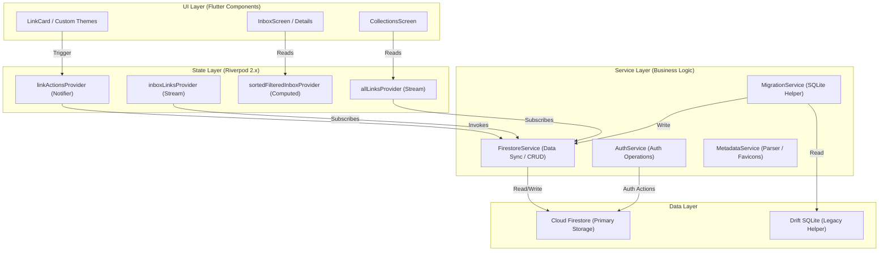

# System Architecture Overview

LinkShelf is a cross-platform reading list manager built on Flutter and Cloud Firestore. It is designed around a core time-based "freshness decay" mechanic, prioritizing local-first speed with background cloud synchronization.

This document provides a high-level view of the application layers, cross-platform compilation targets, and structural hierarchy.

---

## ✦ Architectural Layers

The application follows a clean, unidirectional data flow hierarchy separated into three main layers:

### 1. UI Layer
Built entirely using Flutter declarative widgets. Key views adapt to screen constraints dynamically:
- **Mobile layout**: Compact single-column view with bottom navigation.
- **Desktop/Widescreen layout**: Persistent left sidebar with fluid grid spacing.
- **Browser Extension popup**: Configured fixed viewport (400x600px) matching extension toolbar constraints.

### 2. State Layer (Riverpod 2.x)
Exposes streams of remote data and manages local filters, text search state, and multi-select sets. The `sortedFilteredInboxProvider` performs dynamic freshness score calculations and sorting in memory on incoming streams, keeping CPU cycles decoupled from database reads.

### 3. Service Layer
Capsulates single-purpose subsystems such as HTML metadata parsing, background local notifications scheduling, share intent listeners, and legacy DB migration routines.

### 4. Data Layer
- **Cloud Firestore**: Holds user-owned documents securely. Documents are structured under absolute user namespace paths: `/users/{userId}/`.
- **Drift SQLite**: Handles legacy migration helper storage on startup, then yields control once data has been verified and committed to the cloud.

---

## ✦ Cross-Platform Compilation Strategy

LinkShelf compiles to four target platforms from a single codebase:

| Platform | Runner / Target | Persistence Engine | Special Interops |
|---|---|---|---|
| **Android** | Native Android JVM Runner | Cloud Firestore | `receive_sharing_intent` (Share Sheet listeners) |
| **macOS** | Native Cocoa | Cloud Firestore | Window manager constraints config |
| **Windows** | Native Win32 | Cloud Firestore (Fallback local) | Dynamic titlebars |
| **Web / Extension** | Chrome / Safari popup | Cloud Firestore | JS Interop (`dart:js_interop`) tab queries |

To support this variety, the codebase employs **conditional exports** (e.g. for extension services) to allow compilation across native mobile/desktop platforms and restricted browser sandbox environments without pulling web-only symbols into native targets.
