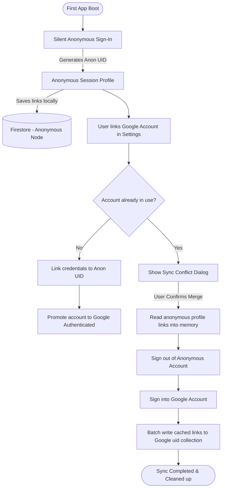

# Sync, Authentication, and Security

LinkShelf prioritizes a friction-free onboarding experience while keeping user databases synced securely across all active devices. 

This document details the transition from anonymous profiles to full Google Cloud Synchronization, data-merging routines, and the underlying Firestore security rules.

---

## ✦ Auth and Sync Flow

The lifecycle of a user session proceeds through two main authentication states:



---

## ✦ Transparent Anonymous Onboarding

On first boot, the app executes a silent anonymous login via Firebase Auth. The user is instantly granted a secure UID and can start using the application immediately without providing an email address or choosing a password. 

Data is written directly to Firestore under `/users/{anonymousUid}/` and remains cached on the device even when offline.

---

## ✦ Google Account Integration & Conflict Merging

To sync lists across multiple devices, users link a Google account from the Settings screen. If the Google account is new to the system, the anonymous credentials are promoted to a Google-linked account directly, preserving all saved data.

### Conflict Resolution Merge Routine
If the Google account has already been used on another device, Firebase will reject a simple credential link. To prevent data loss during this conflict, LinkShelf executes a client-side merge:

1. **Memory Caching**: The app queries the local Firestore cache and loads all lists, custom filters, and highlights created during the anonymous session into local memory.
2. **Account Switching**: The app signs out of the anonymous account and authenticates with the Google credentials, swapping the active session UID.
3. **Transactional Batch Write**: The app pushes the cached memory records into the target Google account's `/users/{googleUid}/` sub-collections in batch writes, ensuring that all temporary links are safely merged.
4. **Cleanup**: The temporary anonymous data is orphaned/purged from the cloud database.

---

## ✦ Path-Isolated Security Rules

Data separation is enforced at the database level by Cloud Firestore Security Rules. User profiles cannot view, modify, or list documents belonging to other UIDs:

```javascript
rules_version = '2';
service cloud.firestore {
  match /databases/{database}/documents {
    match /users/{userId}/{document=**} {
      allow read, write: if request.auth != null && request.auth.uid == userId;
    }
  }
}
```

The wildcard pattern `{document=**}` recursively matches all nested collections, including folders, custom filters, notes, and metrics dashboards.
