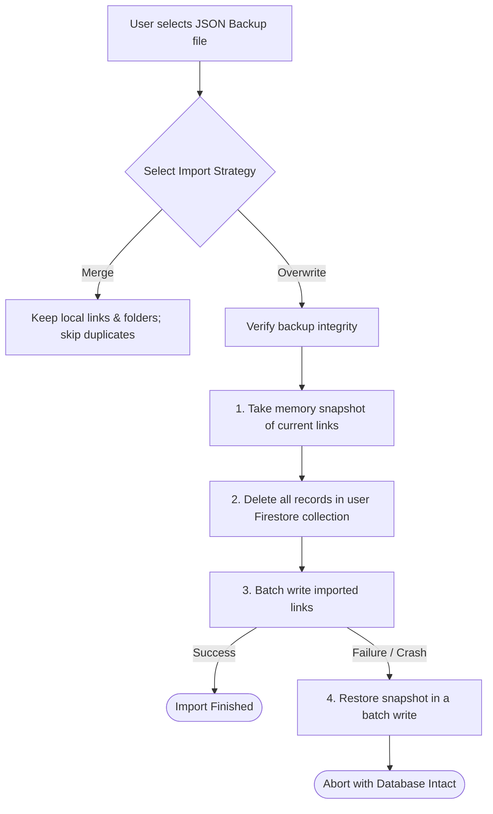

# Data Import and Backup Tools

To ensure data ownership and portability, LinkShelf includes a suite of import and export tools. Users can migrate to the app from traditional bookmark systems or create full backups of their link histories.

---

## ✦ Supported Formats

### 1. Netscape HTML Bookmarks
LinkShelf parses and generates standard **Netscape HTML Bookmark file bundles** (the format used by Chrome, Safari, Firefox, and services like Pocket or Raindrop). This allows users to import standard browser exports in one go.

### 2. JSON Database Dumps
Users can export their entire database—including folders, notes, custom tags, highlights, and history logs—as a single JSON backup.

---

## ✦ Import Strategies

When restoring a backup, the app prompts the user to choose an import strategy:

- **Merge (Default)**: Keeps all existing local links and collections. Incoming elements with matching URLs are updated, while new ones are appended.
- **Overwrite**: Wipes the active Firestore collection clean before importing. This is useful when moving settings and lists from one account to another.

---

## ✦ Client-Side Transactional Rollbacks

Because importing thousands of records involves multiple batch writes, a network failure or format parsing error mid-transfer could result in a corrupted, half-imported database.

To prevent this:
1. **Pre-flight Snapshotting**: Before modifying the database, the `ExportService` reads the complete user directory into memory.
2. **Batch Ingestion**: Documents are written in chunk batches of 100.
3. **Automatic Rollback**: If an exception occurs during the batch writes, the system halts immediately and restores the initial database state from the memory snapshot in a single write, keeping your database safe.
