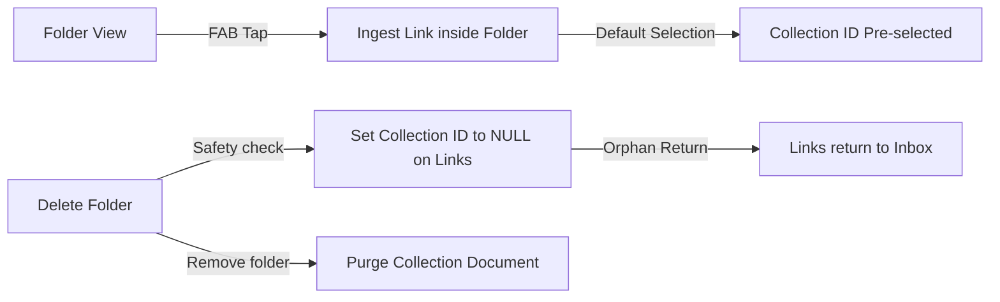

# Folder Collections System

**Collections** are user-defined folders to group and structure links. They offer a way to keep research materials, articles, and video playlists organized, while keeping the dynamic decay model active inside each directory.

---

## ✦ System Intent and Product Value

LinkShelf uses collections to prevent "out of sight, out of mind" procrastination. Unlike traditional folders, every collection computes and displays an **Average Freshness Index** in real time:

- **Erosion Tracking**: The collection card displays the average decay score of all nested active links.
- **Attention Indicator**: If an entire collection begins decaying (e.g. average score falls below `0.50`), the collection card shifts color accents, warning you that folder contents are going stale.

---

## ✦ Tactile Visual Design

The Collections screen focuses on a physical, tactile interface:
- **Card Stack Design**: Folder cards are styled to look like physical directory folders. Nested cards peek out from behind the primary directory tab to visually indicate depth.
- **Spring Scale Animations**: Tap targets react with custom spring micro-scaling. Long-pressing or tapping folder cards triggers spring animation profiles for physical, haptic feedback.

---

## ✦ Collection Operations

### 1. In-Folder Direct Ingestion
Tapping the Floating Action Button inside a specific folder opens the `AddLinkSheet` with that collection pre-selected, saving the user from having to assign folders after the link is added.

### 2. Folder Deletion Safety Net
Deleting a collection **never deletes the links inside it**. Instead, the system updates all links under that folder, setting their `collectionId` back to `null`. The articles safely return to the general Inbox, preventing accidental database loss.
