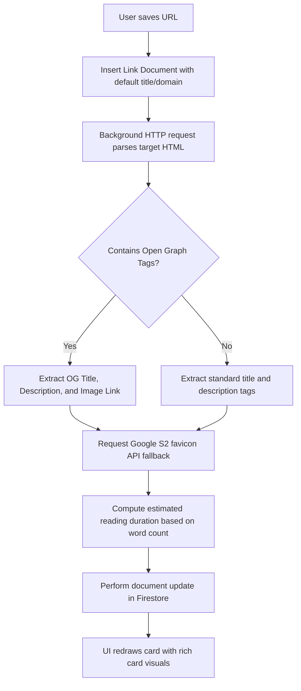

# The LinkShelf Inbox

The **Inbox** is the primary interface of LinkShelf. Unlike traditional bookmarking lists that hide old links at the bottom, LinkShelf’s Inbox is sorted by **ascending freshness**—bubbling the oldest, most decaying links directly to the top to demand user attention.

---

## ✦ System Intent and Behavior

The Inbox enforces reading discipline through visual and layout constraints:
- **Urgency Ordering**: Links decay in real time. Stale links rise to the top of the feed automatically, prompting you to read or snooze them before they reach critical decay thresholds.
- **Visual Decay Indicators**: Each link card features a color-coded status bar (`green → yellow → orange → red`) and a numeric score badge (`1.00` down to `0.00`) representing its decay status.
- **Age Labels**: Relative timestamp labels ("just now", "3 days ago", "1 wk ago") are computed dynamically to express decay in human-friendly terms.

---

## ✦ Automatic Metadata Ingestion

When a link is saved, LinkShelf triggers a background metadata scraping sequence:

If the scraper fails due to network issues or target restrictions, the system falls back to displaying the base domain and a generic initial lettermark avatar.

---

## ✦ Search and Filtering

- **Full-Text Live Search**: Search terms match page titles, tag names, and domains dynamically in memory.
- **Dead Link Warnings**: The background link scanner periodically checks URLs for broken states. Unreachable pages (e.g. returning 404 or 5xx status codes) are flagged in the inbox with a `☠️ DEAD LINK` warning banner, indicating they should be exported, deleted, or repaired.
- **Metadata Editing**: Tapping a link card navigates to the details panel where you can edit titles, add custom tags, and write personal notes.
